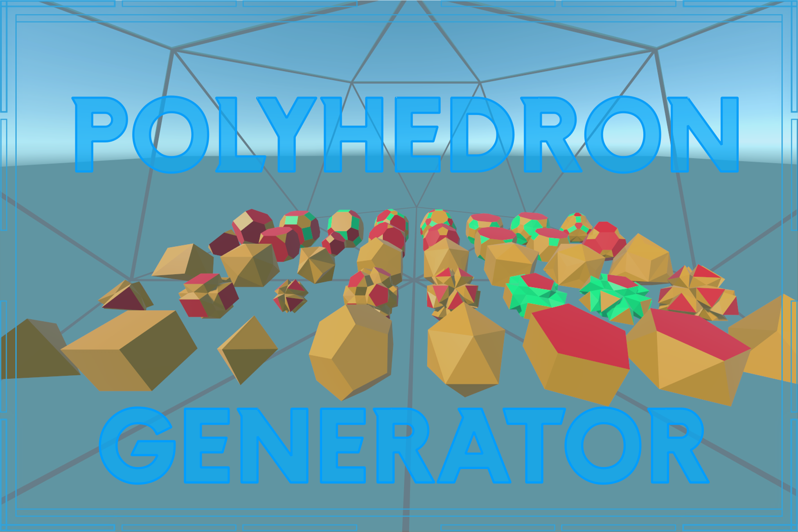

# Polyhedron Generator

Thanks for purchasing this asset!

## Quickstart
To quickly get to use this asset you can watch the following video:

Alternatively, you can read the following instructions.

1. Create a new GameObject to hold your polyhedra.
2. Add the `PolyhedronGenerator` script. This will also add a `MeshFilter` component to your GameObject.
3. Add a `MeshRenderer` component to the GameObject to render the polyhedra and assign a material.
4. After that you should see the generated polyhedra. You can scale it with the `radius` parameter.
5. Now you can change the base shape or modify the mesh with the operators.

## Polyhedron Generator Component
This generator takes a polyhedron base shape and modifies it through operations.

### Available base shapes
You can choose from all Platonic solids, Johnson solids, regular prisms, and anti-prisms.
- Tetrahedron
- Cube
- Octahedron
- Dodecahedron
- Icosahedron
- 94 Johnson solids: You can choose the Johnson shape with the slider in the component. I won't explain all of them here but Wikipedia has nice explanations.
- N-Sided regular prisms: You can modify the prism with the sides and height parameter
- N-Sided regular anti-prisms: You can modify the anti-prism with the sides and height parameter

### Available Operations
Most of these operations are described in Conways Polyhedron notation.
You can combine them.

Some of them take an additional `Amount` parameter into account.
This value describes the extent of the transformation.

You can use the `degree` parameter to limit the operation to faces with certain edges.
`degree` zero applies the operation on all faces.

- Dual: Make Faces to Edges and Edges to Faces, Ignores the amount
- Truncate: Create a new face at each edge
- Ambo: Similar to truncate create regular polygons, Ignores the amount
- Kis: Create a pyramid on each face. Amount controls the height of the pyramid.
- Join: Same as: Dual, Ambo, Dual, Ignores the amount
- Meta: Kis with degree 3 and Join
- Gyro: Rotates each edge on the face
- Chamfer: Chamfers each edge
- Ortho: Same as: Join, Join, Ignores the amount
- Bevel: Same as Truncate the amount 10 and Ambo,
- Quinto: Creates a face in the middle of each face aligned with the vertices
- Whirl: Creates a face in the middle of each face aligned with the edges
- Inset: Creates a new inset face on each face
- Subdivide (non-Conway): Triangulates every face with >4 vertices. Every face with 3 vertices gets split into 4 smaller 3-vertice faces.

### Other Parameters
- Radius: Scale of the base-polyhedron vertices
- Live Update: Controls if the polyhedron updates immediately. If it is disabled, you have to use the `generate` context menu.
- Double Sided: Whether the meshbuilder should generate the inwards faces of the polygon.
- Randomize Vertex Positions: Moves all vertexes in a random direction. If you want to keep the generated mesh you have to use the `saveMesh` context menu.

## Context menu actions
- generate: Generates the current polygon and stores it in the `MeshFilter` of the same GameObject.
- saveMesh: Saves the current `MeshFilter` mesh to a file. 

## Performance consideration
You might use the polyhedron generator at runtime.
Every modifying operation hurts your performance.
I would advise to pre-calculate every needed polygon mesh.

## Bonus Wireframe Generator
The Wireframe Generator takes a Mesh and generates a new Mesh with faces along all edges.
If you don't have a simple mesh you won't be able to generate the wireframe at runtime.

### Parameters:
- Mesh: Mesh to create wireframe for
- Mesh Filter: `MeshFilter` to create wireframe for. If both `Mesh` and `Mesh Filter` parameters are set `Mesh Filter` takes precedence.
- Width: Width of the faces along the edges
- Type: 
  - TWO_PLANE: two planes standing orthogonal on each other, intersecting in the middle
  - POLYGON: a regular polygon with `Polygon Edge Count` sides